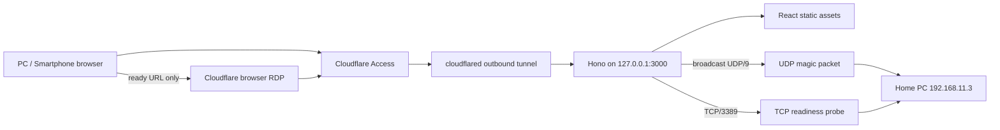

# Remote Console

自宅PCへWake-on-LAN（WOL）を送信し、RDPのTCP受付開始を確認してからCloudflareのブラウザRDPへ接続する、個人利用向け管理画面です。対象IP、MACアドレス、UDP/RDPポート、接続URLはすべてHonoサーバーの環境変数で固定します。ブラウザから接続先を指定するAPIはありません。

## 調査結果と採用方針（2026-07-22）

実装前に各プロジェクトの公式資料を確認し、次の構成に固定しました。

| 領域            | 採用内容                                                   | 判断理由                                                                                                                   |
| --------------- | ---------------------------------------------------------- | -------------------------------------------------------------------------------------------------------------------------- |
| Toolchain       | Vite+ 0.2.5（Vite 8 / Vitest 4 / Oxlint / TypeScript統合） | `vp dev`、`vp build`、`vp pack`、`vp check`、`vp test`へ開発コマンドを集約できるため。Vite+は0.xのため完全固定しています。 |
| UI              | React 19.2、TypeScript 7、Tailwind CSS 4、shadcn/ui方式    | Reactの最新安定系列とTailwindの公式Viteプラグインを使用。UI部品はアプリ内に所有し、不要なランタイムを増やしません。        |
| Server state    | TanStack Query 5                                           | API状態、mutation、再取得を一元化。`starting`は2.5秒、`ready`は15秒、それ以外は10秒間隔で再確認します。                    |
| API             | Hono 4、Node.js adapter、Zod 4                             | Node.js上で小さいHTTP境界を作り、入力と出力を共通Zodスキーマで検証します。                                                 |
| Runtime         | Node.js 24 LTS                                             | Node.js 24の`Promise.withResolvers`、組み込みUDP/TCP API、`--env-file`を利用します。                                       |
| External access | Cloudflare Tunnel + Access                                 | 管理画面とブラウザRDPをAccessで認証し、LXCへ外部向け待受ポートを開けません。APIはAccess JWTも再検証します。                |
| Font            | LINE Seed JP（self-host）                                  | 外部フォント配信へ接続せず、400/700のWOFF2だけを本番成果物へ含めます。ライセンスは`public/LINE_SEED_JP_LICENSE.txt`です。  |

参照した一次資料:

- [Vite+ Getting Started](https://viteplus.dev/guide)
- [React versions](https://react.dev/versions)
- [Tailwind CSS: Using Vite](https://tailwindcss.com/docs/installation/using-vite)
- [shadcn/ui: Vite](https://ui.shadcn.com/docs/installation/vite)
- [TanStack Query: Important Defaults](https://tanstack.com/query/latest/docs/framework/react/guides/important-defaults)
- [Hono: Node.js](https://hono.dev/docs/getting-started/nodejs)、[JWK middleware](https://hono.dev/docs/middleware/builtin/jwk)
- [Node.js release schedule](https://nodejs.org/en/about/previous-releases)
- [Cloudflare: Connect to RDP in a browser](https://developers.cloudflare.com/cloudflare-one/networks/connectors/cloudflare-tunnel/use-cases/rdp/rdp-browser/)
- [Cloudflare: Install cloudflared on Linux](https://developers.cloudflare.com/cloudflare-one/networks/connectors/cloudflare-tunnel/downloads/)
- [Cloudflare: Create a remotely-managed tunnel](https://developers.cloudflare.com/cloudflare-one/networks/connectors/cloudflare-tunnel/get-started/create-remote-tunnel/)
- [Cloudflare Access: Publish a self-hosted application](https://developers.cloudflare.com/cloudflare-one/access-controls/applications/http-apps/self-hosted-public-app/)
- [Proxmox VE: Linux Container networking](https://pve.proxmox.com/pve-docs/pve-admin-guide.html#_linux_container_networking)
- [LINE Seed](https://seed.line.me/)

## アーキテクチャ



単一のNode.jsプロセスが本番UIとAPIを配信します。`cloudflared`もLXC内から外向きに接続し、Honoはloopbackだけで待ち受けます。WOL送信とRDP監視はサーバーだけが行います。

### 状態遷移

| 状態       | 判定                                   | UI                                         |
| ---------- | -------------------------------------- | ------------------------------------------ |
| `offline`  | RDP TCP接続不可、起動処理中ではない    | 「PCを起動する」を有効化                   |
| `starting` | WOL送信後、RDP未応答かつ起動待ち時間内 | 進捗表示。2.5秒ごとに監視                  |
| `ready`    | `TARGET_IP:RDP_PORT`へのTCP接続成功    | サーバーが返したHTTPSの`RDP_URL`だけを表示 |
| `error`    | 起動待ち時間超過、またはWOL送信失敗    | 原因別メッセージと再実行導線を表示         |

WOL magic packetは`FF` 6バイトとMACアドレス16回からなる102バイトです。既定ではブロードキャストへ3回送信します。RDP判定は認証ではなくTCP接続受付の確認です。

### API

| Method | Path          | Request                                            | Success                                                         |
| ------ | ------------- | -------------------------------------------------- | --------------------------------------------------------------- |
| `GET`  | `/healthz`    | なし                                               | `200 {"status":"ok"}`                                           |
| `GET`  | `/api/status` | body/queryともになし                               | `200 TargetStatus`                                              |
| `POST` | `/api/wake`   | `Content-Type: application/json`、bodyは厳密に`{}` | packet送信時`202 TargetStatus`、既にreadyなら`200 TargetStatus` |

`/api/wake`へ`{"ip":"..."}`、`{"macAddress":"..."}`などを渡すと`400 INVALID_REQUEST`です。`/api/status?ip=...`など、どちらのAPIもquery parameterを拒否します。

エラー形式:

```json
{
  "error": {
    "code": "WAKE_COOLDOWN",
    "message": "連続実行を防ぐため、あと60秒お待ちください。",
    "requestId": "request-correlation-id",
    "retryAfterSeconds": 60
  }
}
```

### セキュリティ境界

- 接続先IP、MAC、WOL broadcast、各ポート、RDP URLはサーバー環境変数だけに存在します。`VITE_*`環境変数は使用しません。
- 本番は既定でAccess JWT検証が`required`です。team issuer、JWK署名（RS256）、application audienceを検証します。設定不足時は起動に失敗します。
- Cloudflare Accessを管理画面のhostname全体へ適用します。アプリのJWT検証はAPIに対する多層防御です。
- POSTは同一hostの`Origin`/Fetch Metadataを確認し、Hono CSRF middlewareも適用します。
- POST bodyは1 KiBまで、JSONかつ空のstrict objectだけです。
- 全APIにidentity単位のrate limit、WOL APIに別の低いrate limit、controllerに送信cooldownと同時実行lockがあります。
- CSP、`frame-ancestors 'none'`、`X-Frame-Options: DENY`、HSTS、Permissions Policy、`no-store`を付与します。
- Access subjectまたは送信元IPはSHA-256でハッシュしてrate-limit keyにし、値をログへ出しません。
- RDP 3389をインターネットへ直接公開しません。管理APIもpublic interfaceでは待ち受けません。

rate limitと起動状態は単一プロセスのメモリ内です。再起動すると履歴はリセットされますが、Cloudflare Access、strict API、対象PC側の状態は変わりません。個人利用の単一instanceを前提としています。

## プロジェクト構成

```text
.
├── deploy/remote-console.service       # hardened systemd unit
├── public/                             # favicon and font license
├── src/
│   ├── client/
│   │   ├── components/ui/              # shadcn/ui方式の所有コンポーネント
│   │   ├── App.tsx                     # lifecycle dashboard
│   │   ├── api.ts                      # fixed-shape API client
│   │   ├── main.tsx
│   │   └── styles.css
│   ├── server/
│   │   ├── security/rate-limiter.ts
│   │   ├── services/{wol,rdp-probe,target-controller}.ts
│   │   ├── app.ts                      # Hono routes/middleware
│   │   ├── config.ts                   # Zod environment validation
│   │   └── index.ts                    # Node entrypoint
│   └── shared/contracts.ts             # API Zod schemas/types
├── .env.example
├── package.json
└── vite.config.ts
```

テストは対象実装と同じディレクトリの`*.test.ts(x)`です。

## 環境変数

`.env.example`に安全なサンプルがあります。主要値:

| Variable                  | Default/sample                                | 制約・用途                         |
| ------------------------- | --------------------------------------------- | ---------------------------------- |
| `NODE_ENV`                | `development`                                 | 本番は必ず`production`             |
| `SERVER_HOST`             | `127.0.0.1`                                   | Tunnelと同居するため変更不要       |
| `SERVER_PORT`             | `3000`                                        | Hono local port                    |
| `TARGET_NAME`             | `自宅PC`                                      | UIに返す唯一のtarget metadata      |
| `TARGET_IP`               | `192.168.11.3`                                | server-only IPv4                   |
| `TARGET_MAC`              | `9C:6B:00:94:06:8A`                           | server-only MAC                    |
| `WOL_BROADCAST_ADDRESS`   | `192.168.11.255`                              | 実際のLAN subnetに合わせる         |
| `WOL_BIND_ADDRESS`        | `0.0.0.0`                                     | 必要ならLXCのLAN IPv4へ固定        |
| `WOL_PORT`                | `9`                                           | UDP destination                    |
| `WOL_PACKET_COUNT`        | `3`                                           | 1〜5                               |
| `WOL_PACKET_INTERVAL_MS`  | `100`                                         | 0〜2000 ms                         |
| `RDP_PORT`                | `3389`                                        | server-only TCP destination        |
| `RDP_URL`                 | セットアップ済みURL                           | HTTPS必須。ready時だけclientへ返す |
| `RDP_CONNECT_TIMEOUT_MS`  | `1500`                                        | TCP probe timeout                  |
| `RDP_PROBE_CACHE_MS`      | `1000`                                        | 同時pollの重複接続抑止             |
| `STARTUP_TIMEOUT_SECONDS` | `180`                                         | 30〜900                            |
| `WAKE_COOLDOWN_SECONDS`   | `60`                                          | 10〜3600                           |
| `API_RATE_LIMIT_MAX`      | `120 / 60秒`                                  | statusを含むAPI全体                |
| `WAKE_RATE_LIMIT_MAX`     | `5 / 900秒`                                   | identityごとのWOL上限              |
| `ACCESS_JWT_MODE`         | development=`disabled`, production=`required` | 本番では`required`を明示推奨       |
| `ACCESS_TEAM_DOMAIN`      | なし                                          | `<team>.cloudflareaccess.com`      |
| `ACCESS_AUD`              | なし                                          | Access application AUD tag         |

## ローカル開発

前提: `.node-version`のNode.js 24.18.0とnpm 11.17.0。

```bash
git clone https://github.com/TkymHrt/remote-console.git
cd remote-console
npm ci
cp .env.example .env
npm run dev
```

- UI: <http://127.0.0.1:5173>
- API: <http://127.0.0.1:3000>
- Vite dev serverが`/api`と`/healthz`をHonoへproxyします。
- `NODE_ENV=development`ではAccess JWT検証が無効です。LAN外へ公開しないでください。
- 既定値は実機宛てです。誤って起動したくない開発環境では、`.env`の`TARGET_IP`、`WOL_BROADCAST_ADDRESS`、`RDP_URL`を隔離したtest networkへ変更してください。

品質確認:

```bash
npm run check
npm test
npm run build
```

成果物は`dist/client/`と`dist/server.mjs`です。`npm start`は`.env`を読み、構築済みserverを起動します。

## Proxmox Linux Containerへのデプロイ

### 1. LXCネットワーク

1. Ubuntu LTSのunprivileged LXCを作成します。amd64、1 vCPU、512 MiB以上を目安にします。
2. `net0`を物理LANへ接続されたLinux bridge（通常`vmbr0`）へ接続します。NAT/routed networkではなく、対象PCと同じbroadcast domainへ置きます。
3. 例としてLXCへ`192.168.11.0/24`内の未使用固定IPまたはDHCP reservationを割り当てます。
4. Proxmox host/LXC firewallを使う場合、次を許可します。
   - outbound UDP: `192.168.11.255:9`
   - outbound TCP: `192.168.11.3:3389`
   - outbound TCP 443/DNS: Cloudflare TunnelとAccess JWK取得
   - inbound internet trafficは不要

LXC内で経路を確認します。

```bash
ip -4 address show
ip route get 192.168.11.3
nc -zvw2 192.168.11.3 3389   # PC起動・RDP有効時に成功
```

broadcastが別subnetになる場合は`WOL_BROADCAST_ADDRESS`を実ネットワークに合わせてください。

### 2. Node.jsとアプリ

以下はamd64と`.node-version`の24.18.0を使う例です。

```bash
sudo apt-get update
sudo apt-get install -y ca-certificates curl git xz-utils

NODE_VERSION=24.18.0
cd /tmp
curl -fSLO "https://nodejs.org/dist/v${NODE_VERSION}/node-v${NODE_VERSION}-linux-x64.tar.xz"
curl -fSLO "https://nodejs.org/dist/v${NODE_VERSION}/SHASUMS256.txt"
grep " node-v${NODE_VERSION}-linux-x64.tar.xz$" SHASUMS256.txt | sha256sum -c -
sudo tar -xJf "node-v${NODE_VERSION}-linux-x64.tar.xz" -C /usr/local --strip-components=1
sudo npm install --global npm@11.17.0
node --version
npm --version

sudo useradd --system --home-dir /opt/remote-console --create-home \
  --shell /usr/sbin/nologin remote-console
sudo git clone https://github.com/TkymHrt/remote-console.git /opt/remote-console
sudo chown -R remote-console:remote-console /opt/remote-console
cd /opt/remote-console
sudo -u remote-console npm ci
sudo -u remote-console cp .env.example .env
sudo chmod 600 .env
sudo editor .env
```

`.env`では少なくとも次を本番値にします。Access値は後述のapplication作成後に取得します。

```dotenv
NODE_ENV=production
SERVER_HOST=127.0.0.1
SERVER_PORT=3000
TARGET_IP=192.168.11.3
TARGET_MAC=9C:6B:00:94:06:8A
WOL_BROADCAST_ADDRESS=192.168.11.255
RDP_PORT=3389
RDP_URL=https://rdp.tkymhrt.dpdns.org/rdp/1d2a8e0b-3bf8-4c62-bba1-5a797e224c58/192.168.11.3/3389
ACCESS_JWT_MODE=required
ACCESS_TEAM_DOMAIN=your-team.cloudflareaccess.com
ACCESS_AUD=your-console-access-application-aud
```

buildとservice登録:

```bash
cd /opt/remote-console
sudo -u remote-console npm run check
sudo -u remote-console npm test
sudo -u remote-console npm run build
sudo -u remote-console npm prune --omit=dev

sudo install -m 0644 deploy/remote-console.service /etc/systemd/system/remote-console.service
sudo systemctl daemon-reload
sudo systemctl enable --now remote-console
sudo systemctl status remote-console
curl -fsS http://127.0.0.1:3000/healthz
sudo journalctl -u remote-console -f
```

unitはfilesystem read-only、no-new-privileges、限定address familyなどのsystemd hardeningを有効にしています。アプリは永続ファイルを書きません。

更新時:

```bash
cd /opt/remote-console
sudo systemctl stop remote-console
sudo -u remote-console git pull --ff-only
sudo -u remote-console npm ci
sudo -u remote-console npm run check
sudo -u remote-console npm test
sudo -u remote-console npm run build
sudo -u remote-console npm prune --omit=dev
sudo systemctl start remote-console
curl -fsS http://127.0.0.1:3000/healthz
```

## Cloudflare Tunnel / Access

### 1. cloudflared

Cloudflare公式APT repositoryから同じLXCへinstallします。

```bash
sudo mkdir -p --mode=0755 /usr/share/keyrings
curl -fsSL https://pkg.cloudflare.com/cloudflare-main.gpg \
  | sudo tee /usr/share/keyrings/cloudflare-main.gpg >/dev/null
echo 'deb [signed-by=/usr/share/keyrings/cloudflare-main.gpg] https://pkg.cloudflare.com/cloudflared any main' \
  | sudo tee /etc/apt/sources.list.d/cloudflared.list
sudo apt-get update
sudo apt-get install -y cloudflared
```

Zero Trust dashboardでremotely-managed Tunnelを作成し、表示されたLinux service commandをLXCで実行します。

```bash
sudo cloudflared service install YOUR_ONE_TIME_TUNNEL_TOKEN
sudo systemctl status cloudflared
```

TunnelのPublic Hostnameを追加します。

- Hostname例: `console.example.com`
- Service type: `HTTP`
- URL: `localhost:3000`

Honoは`127.0.0.1`だけで待ち受けるため、cloudflaredは同じLXCへ置きます。別hostへ置く場合だけ`SERVER_HOST`とLAN firewallを再設計してください。

### 2. Cloudflare Access application

1. Zero TrustのAccess > ApplicationsでSelf-hosted applicationを作成します。
2. application domainへ上記`console.example.com`を設定します。
3. Allow policyを自分のidentity/emailだけに限定します。BYPASS policyは作成しません。
4. applicationのAUD tagを取得し、`.env`の`ACCESS_AUD`へ設定します。
5. Zero Trust team domain（`<team>.cloudflareaccess.com`）を`ACCESS_TEAM_DOMAIN`へ設定します。
6. `ACCESS_JWT_MODE=required`を確認して`systemctl restart remote-console`を実行します。

Accessは外部HTTP requestを認証し、`Cf-Access-Jwt-Assertion`をoriginへ付与します。HonoはそのJWTをteam JWK、issuer、AUDで再検証します。値が違う場合、UIのAPIは401になります。

既存のブラウザRDP URLは`RDP_URL`としてserverだけに保存され、`ready`時だけボタンになります。RDP用hostname/applicationの既存設定はそのまま利用します。TCP/3389をPublic Hostnameとして直接公開したり、routerでport-forwardしたりしないでください。

### 3. 外部確認

1. `https://console.example.com`を未認証browserで開き、Access loginへ遷移することを確認します。
2. login後、停止中/起動処理中/接続可能の状態が表示されることを確認します。
3. readyボタンを開き、ブラウザRDP側のAccessへ遷移することを確認します。
4. LXCで`ss -ltnp`を確認し、アプリが`127.0.0.1:3000`以外へ公開されていないことを確認します。

## 実機確認とトラブルシュート

対象PC側ではBIOS/UEFIとNIC driverのWake-on-LAN（Magic Packet）、Windows Remote Desktop、LAN profileのWindows Firewallを有効にし、`192.168.11.3`をDHCP reservation等で固定します。完全shutdownから起動しない場合はWindows Fast Startup、ErP、省電力時のNIC給電も確認します。

WOL packet確認:

```bash
# LXC側。<lan-interface>はeth0などへ置換
sudo tcpdump -ni <lan-interface> 'udp dst port 9'
# 別browserから「PCを起動する」を1回押す。既定では102-byte datagramが3件見える。
```

代表的な症状:

| 症状                           | 確認箇所                                                                             |
| ------------------------------ | ------------------------------------------------------------------------------------ |
| WOLが届かない                  | LXCが`vmbr0`経由で同一L2か、broadcast address、PVE/LXC firewall、NIC WOL設定         |
| PCは起動したが`starting`のまま | LXCから`nc -zvw2 192.168.11.3 3389`、Windows RDP/firewall、`STARTUP_TIMEOUT_SECONDS` |
| APIが401                       | `ACCESS_TEAM_DOMAIN`、console applicationのAUD、Access policy、JWT header転送        |
| APIが429                       | UI表示または`Retry-After`まで待つ。多重tapをしない                                   |
| 本番serviceが起動しない        | `journalctl -u remote-console`; Access値不足は意図したfail-closed動作                |

## テスト範囲

`npm test`は次のobservable contractを検証します。

- 102-byte magic packetの内容と、loopback UDP socketへの指定回数送信
- TCP portのopen/closed判定
- `offline → starting → ready`、cooldown、起動timeout、送信失敗
- strict API body/query、cross-origin拒否、API/WOL rate limit、security headers、安全な500応答
- UIの起動操作、starting反映、ready時のserver-provided URL、通信エラー表示

実LAN、実PC、Cloudflare identity providerはautomated testから分離しています。デプロイ後は上記の実機確認を行ってください。
